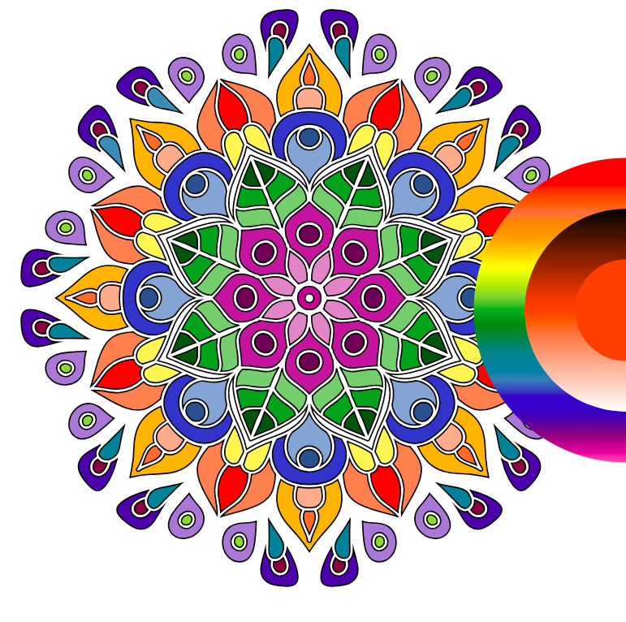
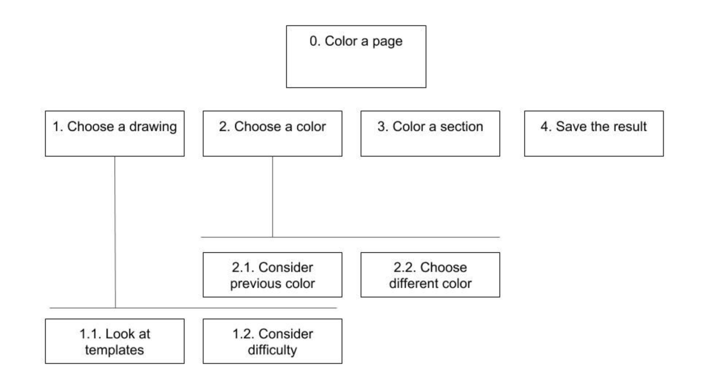
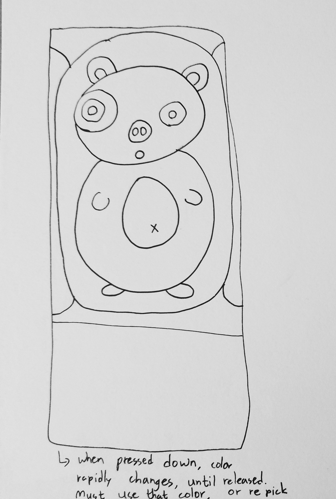
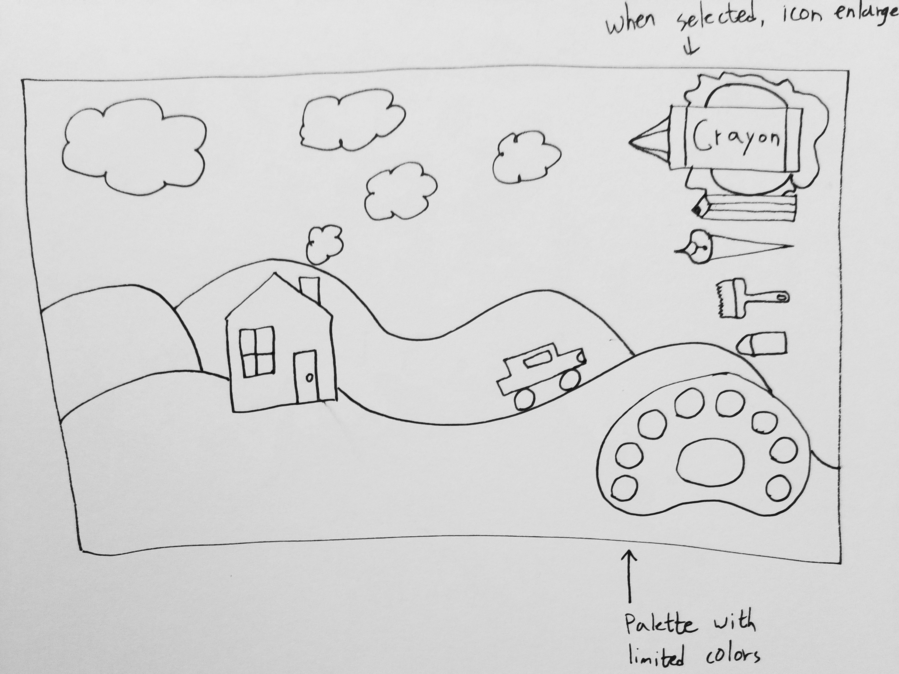
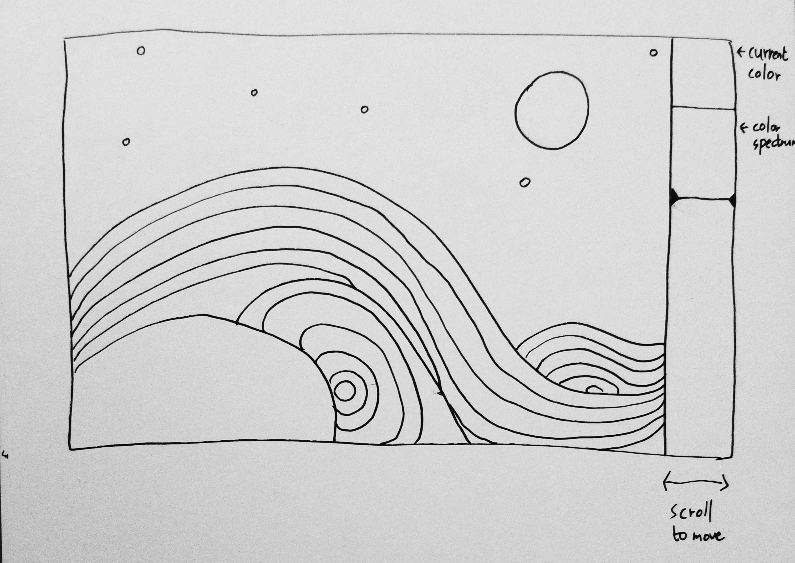

# UIUX Project: Colorfill
<!--finished product design-->

<!--more images of paper prototype-->

A coloring application. The core feature of Colorfill allows user to have refined selection of color through optional secondary spectrum generated based on the initial choice of color. When color is chosen from the outer color spectrum, the inner circle gets filled with gradation generated based on the initial selection. If the user wants to use darker version of the initial color selection, any part of the second circle can be selected for color choice.
  
Several different approachs to prototyping and designing principles, such as hierarchical task analysis and observational study, were used in this project to understand different approaches we can take as UI/UX developers.
   
   
## Cycle I: Investigation and Ideation

### Initial Hierarchical Task Analysis

  
Initial hierarchical task analysis was made to map out the conventional user flow of coloring process. The analysis was than applied to design six prototypes for coloring application.

### Summary of Obeservational Study
  Our observational study of normal coloring interaction were performed by our two users who both regularly enjoy coloring books but had their first time using coloring apps. In the process, we found out the user wants to pick out color very carefully and be not interfered when the coloring process happens. Following this insightful contribution, we ideated our own coloring application that can compete against actual sketchbook and coloring pencils.

### Protocol Summary
  After introducing ourselves and briefly getting to know our users, we explained them about our project. W​ithout any kind of regulation, ​we had our users ​feel free to choose any image they would like to color in any way they want to. We a​sked them to try exploring how to use the app them​selves and comment out loud on any kind of thoughts they come up with.

#### Themes
  **Synethesis Theme**
  * Let users know about the zoom in feature: Both users found themselves desperate at attempting to color somall detailed parts until they realized they could zoom in.
  * Confusing icons: the icons in the application seemed to be unclear. Users either made mistakes or were not aware of what exactly some icons represented.
  
### Sketches
<!--six sketches-->

| **1.Colorfill** | **2. Omnicolor** |
| ---------------------- | --------------------- |
| 

 |  

 |
| The color selection feature shows up when the right edge of the screen gets swiped, and the donut shaped spectrum can be changed to find the color. The margin will show gradation of similar tone colors of the chosen color for user to select as well. The bottom can be swiped to show editorial features and menu of the application. | ​Omni color shows three bars for the color filling process. First two will be for color selection, while the third one will feature all the editorial features and setup. All the functions are on left side to free the right hand solely for art. However, the bar can be moved right for left handed feature.                                                                           |
| **3. Color Spontaneous** | **4. Colorin**  |
| 

 |  

 |
| The application allows very limited experience for choosing color to the user to encourage creativity coming from randomness. When the block bottom gets held down, the whole box will constantly change color according to spectrum. When hand gets removed, the box will show one color, and until the box gets held down again, the user can use that color only, without going back. This forces user to be creative with color used, making the experience unconventional. | The buttons on the right minimize interference of tools with painting process. When each button gets clicked, it expands to show further options to the user, while making other features small to show as much painting possible. |
| **5. Clear Icons** | **6. Simple Is Best** |
| 

 |  

 |
| The application is intended for simplistic use for younger users, hence such minimal and approachable layout. The selection of tool at the top right corner will let user to choose the texture of filling in. The selected tool will be enlarged to show that it has been chosen. The palette below shows colors allowed to use for this picture, making the process lot easier. Icons are very clear at representing their functionalities. | This application allows user to be minimalistic to extreme point, to leave as much room for user to think and decide for himself. The only feature is color spectrum bar, which can be moved up and down to choose from spectrum that includes black and white. The whole bar can also be swiped to be hidden. |

### Ideation: Interaction Sketches  
<!--six different ui design-->

## Cycle II: Low-fidelity Prototype

## Cycle III: High-fidelity Prototype & Demonstration

## Reflection

